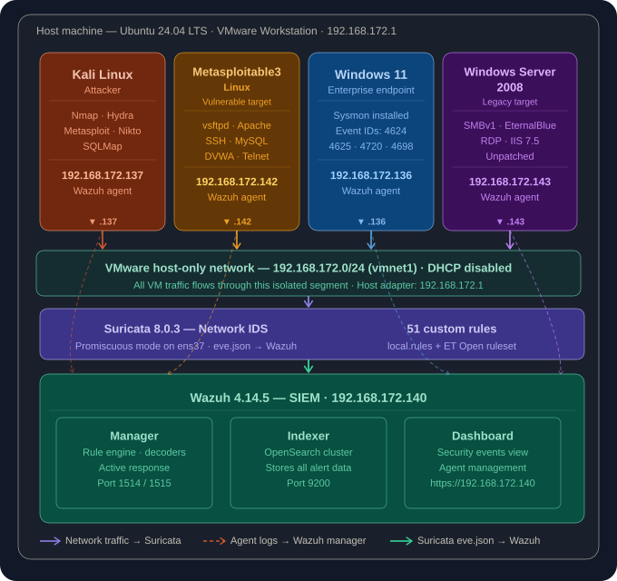

# 🛡️ SOC Detection Lab — Wazuh + Suricata + Kali Linux

> A virtualized cybersecurity home lab simulating a SOC environment with SIEM deployment, network intrusion detection, host-based monitoring, and attack simulation. Built for practical detection engineering and portfolio demonstration.

[](https://wazuh.com)
[](https://suricata.io)
[](https://vmware.com)
[]()

---

## 📋 Table of Contents

1. [Lab Overview](#lab-overview)
2. [Architecture](#architecture)
3. [Repo Structure](#repo-structure)
4. [Environment](#environment)
5. [Component Status](#component-status)
6. [Setup](#setup)
7. [Testing Methodology](#testing-methodology)
8. [Attack Scenarios](#attack-scenarios)
9. [Detection Results](#detection-results)
10. [MITRE ATT&CK Coverage](#mitre-attck-coverage)
11. [Screenshots](#screenshots)
12. [References](#references)

---

## Lab Overview

This lab demonstrates a realistic SOC (Security Operations Center) environment using open-source tooling. It covers the full detection engineering lifecycle — from deploying a SIEM and configuring log ingestion, to simulating real attacks and validating alert generation.

| Capability | Tool |
|---|---|
| SIEM | Wazuh 4.14.5 (Manager + Indexer + Dashboard + Filebeat) |
| Network IDS | Suricata |
| Host Monitoring | Wazuh Agents (Linux + Windows) |
| Attacker | Kali Linux 2026.1 |
| Target — Linux | Metasploitable3 Ubuntu (Ubuntu 14.04) |
| Target — Windows | Windows 11 Pro + Windows Server 2008 |
| Hypervisor Monitoring | Host Ubuntu 24.04.4 LTS (agent installed) |

**Key objectives:**
- Detect network-level attacks via Suricata (port scans, exploit signatures)
- Detect host-level attacks via Wazuh (brute force, privilege escalation, persistence)
- Correlate network and host alerts in a single dashboard
- Simulate realistic attacker TTPs mapped to MITRE ATT&CK
- Build and validate custom detection rules

---

## Architecture



---

## Repo Structure

```
soc-detection-lab/
│
├── README.md
├── architecture/
│   └── lab-diagram.png
│
├── screenshots/
│   ├── wazuh/
│   │   ├── dashboard-overview.png
│   │   ├── agent-inventory.png
│   │   └── alerts-view.png
│   ├── suricata/
│   │   ├── eve-json-logs.png
│   │   └── alert-detection.png
│   ├── attacks/
│   │   ├── nmap-scan.png
│   │   ├── ssh-bruteforce.png
│   │   └── sqli-attack.png
│   └── windows/
│       └── event-logs.png
│
├── configs/
│   ├── wazuh/
│   │   ├── ossec.conf
│   │   └── local_rules.xml
│   ├── suricata/
│   │   ├── suricata.yaml
│   │   └── local.rules
│   └── agents/
│       ├── linux-agent.conf
│       └── windows-agent.conf
│
├── detection-rules/
│   ├── ssh-bruteforce.xml
│   ├── nmap-detection.xml
│   └── web-attacks.xml
│
├── attack-scenarios/
│   ├── nmap.md
│   ├── ssh-bruteforce.md
│   └── dvwa-sqli.md
│
└── docs/
    ├── setup-guide.md
    ├── siem_lab_runbook.md
    ├── siem_methodology_executive.md
    └── detection-improvements.md
```

---

## Environment

### Host Machine

| Component | Detail |
|---|---|
| OS | Ubuntu 24.04.4 LTS |
| Hypervisor | VMware Workstation |
| Network | VMware Host-Only (192.168.172.0/24) |
| Wazuh Agent | host-ubuntu-agent (ID: 005) |

### Virtual Machines

| ID | Agent Name | IP | OS | Role | Agent Status |
|---|---|---|---|---|---|
| 000 | wazuh-siem (server) | 192.168.172.140 | Ubuntu 26.04 LTS | Wazuh Manager + Indexer + Dashboard + Filebeat | Active/Local |
| 005 | host-ubuntu-agent | 192.168.172.1 | Ubuntu 24.04.4 LTS | Host hypervisor monitoring | ✅ Active |
| 006 | kali-agent | 192.168.172.137 | Kali GNU/Linux 2026.1 | Attacker | ✅ Active |
| 009 | metasploitable3-ubuntu-agent | 192.168.172.142 | Ubuntu 14.04 Trusty Tahr | Target — Linux | ✅ Active |
| 011 | windows-11-agent | 192.168.172.136 | Windows 11 Pro 10.0.22621.4317 | Target — Windows | ✅ Active |
| TBC | metasploitable3-winserver2008 | TBC | Windows Server 2008 | Target — Windows Server | ⬜ Agent pending |

### Network

All VMs connect to a VMware Host-Only network (`192.168.172.0/24`). VMs requiring internet access for package downloads use an additional NAT adapter. Each VM has:
- **Adapter 1:** VMware Host-Only (lab traffic)
- **Adapter 2:** NAT (internet — package downloads only, where needed)

---

## Component Status

| Component | Status | Notes |
|---|---|---|
| Wazuh Manager | ✅ Running | v4.14.5 |
| Wazuh Indexer | ✅ Running | node01 |
| Wazuh Dashboard | ✅ Running | https://192.168.172.140 |
| Filebeat | ✅ Running | Shipping logs to indexer |
| Suricata | ⬜ Pending | To be installed on Wazuh VM |
| Suricata → Wazuh | ⬜ Pending | eve.json integration pending |
| Host agent | ✅ Active | Hypervisor monitoring enabled |
| Kali agent | ✅ Active | Attacker endpoint monitored |
| Metasploitable3 Ubuntu agent | ✅ Active | Linux target monitored |
| Windows 11 agent | ✅ Active | Windows target monitored |
| Win Server 2008 agent | ⬜ Pending | Not yet installed |

---

## [Setup](docs/setup-guide.md)

Full installation and configuration instructions are in [`docs/setup-guide.md`](docs/setup-guide.md). It covers:

- **Wazuh all-in-one deployment** — Manager, Indexer, Dashboard, and Filebeat in a single automated install
- **Linux agent deployment** — applies to Kali, Metasploitable3 Ubuntu, and the host machine
- **Windows agent deployment** — PowerShell and GUI installer options for Windows 11 and Server 2008
- **Suricata installation and configuration** — interface setup, HOME_NET, eve.json output
- **Suricata → Wazuh integration** — localfile config, file permissions, verification
- **Log collection configuration** — agent groups for Linux (`auth.log`, `syslog`, Apache) and Windows (Security, System, Sysmon)
- **Custom detection rules** — Nmap HTTP detection, SSH brute force threshold, command injection patterns, Suricata local rules
- **Detection improvements** — false positive suppression, active response auto-blocking
- **Troubleshooting** — agent connectivity, log ingestion, Suricata traffic capture, dashboard health

---

## Testing Methodology

Detection coverage is validated across five telemetry domains, every test mapped to a log source, expected alert, and measurable outcome. The goal is not to "run attacks" — it is to **prove that the SIEM sees what it should see**.

### Telemetry Domains

| Domain | What It Covers |
|---|---|
| **Authentication Events** | Login failures, brute force, credential attacks |
| **Privilege & User Activity** | Account creation, group changes, sudo abuse |
| **Network Attack Patterns** | Reconnaissance, scanning, lateral movement |
| **System Changes** | File integrity, registry, configuration drift |
| **Malware & Exploit Behavior** | Exploitation, persistence, abnormal processes |

### Validation Cycle

Every test must complete all five steps. Partial validation is not coverage.

```
STEP 1 — Generate the event
         Execute the action on the target VM

STEP 2 — Confirm raw log
         Verify the log exists at the source (auth.log, Event Viewer, syslog)

STEP 3 — Confirm ingestion
         Wazuh Dashboard → Discover → search for the agent + event

STEP 4 — Confirm rule match
         Check: alert level fired · rule ID triggered · decoder matched

STEP 5 — Tune if missing
         Enable log collector · adjust decoder · verify rule is active
```

### [Testing Phases](docs/siem_lab_runbook.md)

| Phase | Focus | Objective |
|---|---|---|
| **Phase 1 — Visibility** | SSH failures, RDP failures, basic log flow | Confirm log ingestion from all agents |
| **Phase 2 — Attack Patterns** | Hydra brute force, nmap scans | Validate pattern-based detection |
| **Phase 3 — System Compromise** | User creation, privilege escalation, FIM | Validate endpoint detection depth |
| **Phase 4 — Advanced Behavior** | Metasploit exploits, persistence simulation | Validate behavioral/heuristic rules |

For exact commands, raw log verification steps, and per-phase tuning guidance, see the [operational runbook](docs/siem_lab_runbook.md).

---

## Attack Scenarios

All attacks are executed from Kali Linux (`192.168.172.137`) against lab targets.

### Phase 1 — Visibility Checks

| Test | Target | Purpose |
|---|---|---|
| Agent connectivity check | All agents | Confirm all endpoints reporting |
| SSH failed login (single) | Metasploitable3 Ubuntu | Validate auth log ingestion |
| RDP failed login | Windows 11 | Validate Windows Event Log ingestion |

### Phase 2 — Attack Patterns

| Attack | Tool | Target | Wazuh Rule |
|---|---|---|---|
| SSH brute force | Hydra | Metasploitable3 Ubuntu | 5763 |
| RDP brute force | Hydra | Windows 11 | 60204 |
| Network port scan | Nmap | All targets | 40101 |
| Web vulnerability scan | Nikto | Metasploitable3 Ubuntu | 31151 |

### Phase 3 — System Compromise Simulation

| Attack | Target | Wazuh Rule |
|---|---|---|
| Create local user | Windows 11 | 60145 |
| Add user to Administrators | Windows 11 | 60146 |
| Successful login after failures | Windows 11 | 60109 |
| Sudo privilege escalation | Metasploitable3 Ubuntu | 5401 / 5403 |
| File Integrity Monitoring — Linux | Metasploitable3 Ubuntu | 550 / 553 / 554 |
| File Integrity Monitoring — Windows | Windows 11 | 550 / 553 / 554 |

### Phase 4 — Advanced Behavior

| Attack | Tool | Target | Wazuh Rule |
|---|---|---|---|
| vsftpd backdoor exploit | Metasploit | Metasploitable3 Ubuntu | 5712 |
| Netcat reverse shell | Netcat | Metasploitable3 Ubuntu | 92200 |
| Cron persistence | Manual | Metasploitable3 Ubuntu | 5007 |
| Scheduled task persistence | cmd.exe | Windows 11 | 60145 |
| Simulated malware file activity | Bash | Metasploitable3 Ubuntu | 550 / 92200 |

> Full runbook with exact commands, raw log verification, and tuning guidance: [`docs/siem_lab_runbook.md`](docs/siem_lab_runbook.md)

---

## Detection Results

> To be populated after attack simulation is complete.

| Attack | Detection Source | Wazuh Rule ID | Level | MITRE Technique |
|---|---|---|---|---|
| SSH brute force | auth.log | 5763 | 10 | T1110 |
| RDP brute force | Windows Security | 60204 | 10 | T1110 |
| Port scan | Suricata | 40101 | 8 | T1046 |
| Web scan (Nikto) | Apache logs | 31151 | 6 | T1595.002 |
| New user created | Windows Security | 60145 | 8 | T1136 |
| Privilege escalation | Windows Security | 60146 | 8 | T1548 |
| Sudo abuse | auth.log | 5403 | 3 | T1548 |
| FIM — file change | Wazuh FIM | 550 | 7 | T1565 |
| vsftpd exploit | vsftpd.log | 5712 | 10 | T1190 |
| Reverse shell | syslog | 92200 | 10 | T1059 |
| Cron persistence | syslog | 5007 | 7 | T1053.003 |
| Scheduled task | Windows Security | 60145 | 8 | T1053.005 |

---

## MITRE ATT&CK Coverage

| Tactic | Technique ID | Technique | Simulated Via |
|---|---|---|---|
| Reconnaissance | T1595 | Active Scanning | Nmap |
| Reconnaissance | T1595.002 | Vulnerability Scanning | Nikto |
| Discovery | T1046 | Network Service Scanning | Nmap |
| Credential Access | T1110 | Brute Force | Hydra (SSH + RDP) |
| Initial Access | T1190 | Exploit Public-Facing Application | Metasploit vsftpd |
| Execution | T1059 | Command and Scripting Interpreter | Netcat reverse shell |
| Persistence | T1053.003 | Scheduled Task — Cron | Manual crontab |
| Persistence | T1053.005 | Scheduled Task — Windows | schtasks.exe |
| Persistence | T1136 | Create Account | net user |
| Privilege Escalation | T1548 | Abuse Elevation Control | sudo / net localgroup |
| Defense Evasion | T1027 | Obfuscated Files | base64 encoding |
| Defense Evasion | T1070 | Indicator Removal | File deletion (FIM) |
| Impact | T1565 | Data Manipulation | File modification (FIM) |

---

## Screenshots

| File | Description |
|---|---|
| `screenshots/wazuh/dashboard-overview.png` | Wazuh dashboard home |
| `screenshots/wazuh/agent-inventory.png` | All agents active |
| `screenshots/wazuh/alerts-view.png` | Alert feed |
| `screenshots/suricata/eve-json-logs.png` | Suricata eve.json output |
| `screenshots/suricata/alert-detection.png` | Suricata alert in Wazuh |
| `screenshots/attacks/nmap-scan.png` | Nmap scan detection |
| `screenshots/attacks/ssh-bruteforce.png` | SSH brute force alert chain |
| `screenshots/attacks/sqli-attack.png` | SQL injection detection |
| `screenshots/windows/event-logs.png` | Windows Event Log ingestion |

---

## References

- [Wazuh Documentation](https://documentation.wazuh.com)
- [Suricata Documentation](https://suricata.readthedocs.io)
- [Emerging Threats Rules](https://rules.emergingthreats.net)
- [MITRE ATT&CK Framework](https://attack.mitre.org)
- [DVWA Project](https://dvwa.co.uk)
- [Metasploitable3](https://github.com/rapid7/metasploitable3)

---

## Author

**Wilson Njoroge Wanderi**
Cybersecurity and SOC Engineer

[GitHub](https://github.com/wilsonnjoroge) | [LinkedIn](https://www.linkedin.com/in/wilson-njoroge-wanderi-ccep-cc-kcna-itil%C2%AE4-pho-33b615166/)

> This is Phase 3 of a structured cybersecurity portfolio following the full attack-and-defence lifecycle. Phase 1 (Vulnerability Assessment) and Phase 2 (Penetration Testing) are documented in separate repositories.

---

*README v2.1 — Updated 12th May 2026*
